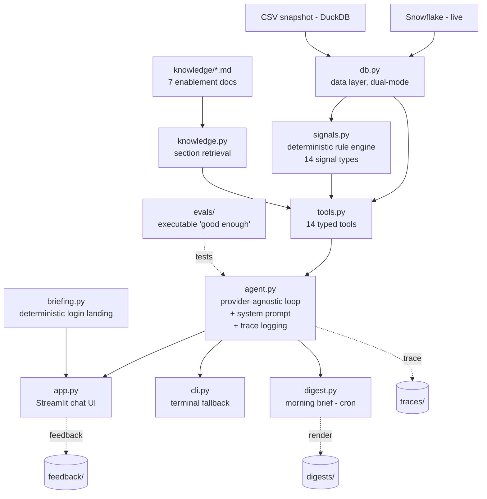

# AE Copilot

A grounded assistant that helps Personio Account Executives prepare for account calls and catch renewals quietly slipping away. It queries the CRM live, applies the sales playbook as deterministic code, and cites every fact. It also works unprompted: a scheduled morning digest ranks each AE's book and flags what needs attention before they ask.

Built for the Internal AI PM case study. Design rationale and scope cuts are in the accompanying one-pager.

**Live demo:** https://ae-copilot-sanjeevrao.streamlit.app/

**Status:** provider-agnostic (OpenAI or Anthropic) · read-only · 14 curated tools · 25 eval cases + 26 unit tests, all green.

---

## What it is, and who it is for

The user is a mid-market Account Executive carrying a book of roughly 40 accounts. It does not summarize what they already know. It surfaces the signal sitting in the data that nobody flags in time: a usage drop, a renewal window opening, a single-threaded deal with no economic buyer, a competitor named in a QBR note, an unresolved P1 ticket.

Two principles shape the build:

1. **AEs need missed signals, not summaries.** The core is a deterministic rule engine, not a chatbot narrating the CRM back to you.
2. **Trust is fragile and asymmetric.** One wrong fact or bad citation ends adoption. So every claim is sourced, the assistant refuses rather than guesses, and the risky work (detection, counting, filtering) is hand-written code, not model judgment.

---

## Four core capabilities

1. **Proactive risk and gap detection.** A deterministic engine (`signals.py`) evaluates 14 signal types against an account: usage decline, renewal windows, overdue or stalled deals, single-threading, missing buyer personas, quiet accounts, open and recent-P1 tickets, competitor mentions, data-quality problems. Each fired signal carries its evidence and the playbook rule behind it. The model prioritizes and explains signals; it cannot invent one the rules did not fire.
2. **Multi-turn chat copilot with citations.** The AE asks anything about their accounts, across turns. It fetches live data at the moment of the question, leads a call-prep answer with what changed and what to flag, and sources every fact inline. Tool calls and the exact SQL are one click away.
3. **Grounded enablement lookup.** The right battlecard section when a competitor is in play, the case study matching the account's industry and region, the playbook guidance for the deal stage. It only cites a document it actually retrieved.
4. **Proactive morning digest.** The same engine on a schedule across the whole book, ranked under one framework and composed into a short brief. Delivery is a labeled dry run in the prototype.

Two behaviors sit under these rather than beside them: **honest refusal** ("the CRM has no record of that", never a guess) and a **closed feedback loop** (see [Quality](#quality-how-we-know-it-works)).

---

## Quick start

The fastest way to try it is the [live demo](https://ae-copilot-sanjeevrao.streamlit.app/). To run locally:

```bash
pip install -r requirements.txt
cp .env.example .env        # add your API key(s)
streamlit run app.py        # chat UI
```

Terminal fallback, identical agent, no UI dependencies:

```bash
python cli.py
```

Both surfaces run the same agent in `agent.py`; the UI is disposable.

### Configuration (`.env`)

| Variable | Values | Meaning |
|---|---|---|
| `LLM_PROVIDER` | `openai` / `anthropic` | which model runs the agent |
| `OPENAI_MODEL` / `ANTHROPIC_MODEL` | model name | defaults: `gpt-4o`, `claude-sonnet-5` |
| `DATA_MODE` | `snapshot` / `live` | local CSVs (dev, test, hosted demo) or Snowflake |
| `AS_OF_DATE` | date | the agent's "today" (see [Data handling](#data-handling-and-limitations)) |
| `OPENAI_API_KEY` / `ANTHROPIC_API_KEY` | key | secrets stay in `.env`, which is gitignored |

Snowflake credentials are only needed when `DATA_MODE=live`; see `.env.example` for the auth options.

---

## Architecture

Detection is deterministic, explanation is probabilistic. Risk signals, reference matching, prioritization, and every count and aggregation are hand-written code. The model orchestrates tools and explains results; it cannot assert a risk the rules did not fire, cite a document it did not read, run a data operation it is not configured for, or write SQL. All queries are hand-written and parameterized.



How a single call-prep question flows through the system:

1. The UI sends the conversation plus the signed-in AE's identity to `agent.py`.
2. The model resolves the account with `find_account`, then runs `run_risk_sweep` proactively.
3. It pulls detail: `get_opportunities`, `get_activities`, and for customers `get_usage` and `get_tickets`.
4. It retrieves any relevant battlecard or case study through the knowledge tools.
5. It composes an answer in the AE's shape (what changed, what to flag) with a source on every fact.

Nothing is special-cased per account; the same machinery runs for any of the 75 accounts.

### Project structure

| Path | Role |
|---|---|
| `db.py` | The only file that touches data. Dual-mode behind one switch: `snapshot` runs SQL over local CSVs with DuckDB; `live` runs the identical SQL against Snowflake. |
| `signals.py` | Deterministic risk rules, each with a hardcoded threshold traceable to a playbook section or interview quote. A rule fires with evidence or stays silent. |
| `knowledge.py` | Loads the seven enablement docs and serves them by section. No vector database; exact retrieval at this corpus size (~40KB) is more reliable and fully explainable. |
| `tools.py` | The 14 typed functions the model may call. Thin wrappers over `db.py` and `signals.py`; each validates its inputs and returns an instructive error rather than an empty success. |
| `agent.py` | The brain. Provider-agnostic tool-calling loop (no agent framework), the system prompt that encodes the grounding contract, and per-conversation trace logging. |
| `app.py` | Streamlit chat UI: AE-facing source chips and a deterministic login briefing; raw tool calls, method cards, and SQL one click away for engineers. |
| `cli.py` | Terminal chat, same agent, zero UI dependencies. Demo-day insurance. |
| `briefing.py` | Deterministic login landing rendered inside the chat window (book overview plus tailored question starters). Zero LLM calls. |
| `digest.py` | Proactive morning brief across an AE's book, ranked by severity. Delivery is a labeled dry run. |
| `evals/` | `cases.py` (25 eval cases), `run_evals.py` (the gate), `unit_tests.py` (26 tool-layer checks), and saved `results_*.json` runs. |
| `data/` | Six snapshot CSVs: accounts, opportunities, contacts, activities, usage, tickets. |
| `knowledge/` | The seven enablement docs: playbook, ICP, Workday and HiBob battlecards, objection handling, pricing cheatsheet, case studies. |
| `traces/`, `feedback/`, `digests/` | Runtime output. Gitignored; they accumulate every dev run and, in production, real AE conversations. |

---

## Key technical choices and trade-offs

| Choice | Alternative rejected | Why, and the trade-off |
|---|---|---|
| Deterministic signal rules | Ask the LLM to spot risks | Same account, same output, every time; individually testable; provenance built in. Trade-off: thresholds are fixed (see limitations). |
| The model never writes SQL | Free-form text-to-SQL | Hallucinated joins are wrong-fact factories, and trust is the whole game. 14 curated, validated tools cover every access pattern. Trade-off: less flexibility on exotic one-off questions. |
| No agent framework | LangChain / LlamaIndex / vendor agent SDKs | The loop is ~40 lines and every line is explainable. Fewer moving parts, full visibility. The brief does not grade framework choice. |
| Direct doc loading by section | Vector database + embeddings | Seven small files. Exact section retrieval beats approximate search here and stays explainable. At a few hundred docs this becomes hybrid search. |
| Read-only by design | Write access to CRM | No write tools are configured; the assistant cannot mutate Snowflake or the knowledge base. A prototype that writes to the CRM is a liability. |
| No customer-facing text generation | Draft emails and call scripts | It prepares the AE, it does not speak for them. Removes a whole class of hallucination risk. |

**Guardrails**, in one place: read-only; no customer-facing text; every tool validates its inputs (a malformed or hallucinated account ID returns an instructive error, never an empty success the model narrates as "no data"); scoped data access (the signed-in AE's identity is set at login and never taken from model text, so "whose book" cannot be spoofed by a prompt).

---

## Data handling and limitations

The synthetic dataset stops on **2026-05-31**. Three consequences, handled explicitly:

- **Anchored "today".** `AS_OF_DATE` defaults to `2026-06-01`, one day after the data ends. On the real clock the last six weeks of the dataset would be empty and every account would look dead. All relative-time logic reads from this anchor. On production data the constant is deleted.
- **Corrupt values excluded.** The usage data contains negative MAU and login values, which are impossible. They are excluded from trend math, and the assistant says it did so rather than silently dropping them.
- **Fixed thresholds.** Signal thresholds (for example, a 20% MAU drop as a decline, a 90-day renewal window) are hardcoded in `signals.py`. Custom-threshold requests ("flag usage drops over 25%") are not processed. Out of scope for the prototype.

---

## Quality: how we know it works

Four layers, from strict to human.

**Tier 1: Deterministic checks.** 26 tool-layer unit tests (`evals/unit_tests.py`, no LLM, runs in seconds) plus the deterministic assertions on all 25 eval cases: tool-usage requirements (a call-prep answer that never fetched the opportunities is wrong even if it reads well), hard facts that must appear (numbers and names, stable across phrasings), and forbidden-fabrication patterns that check for the crime, an invented number, rather than the apology.

**Tier 2: LLM-as-judge.** 8 of the 25 eval cases add a binary PASS/FAIL rubric for criteria that are semantic by nature (did it refuse cleanly, did it flag the data-quality problem, was the discount answer concrete). Graded at temperature 0 by the *opposite* provider from the one that produced the answer, so the system never grades its own homework. Judges are themselves audited by hand-labeling a sample of verdicts.

**Tier 3: Trace logging.** Every conversation is logged to `traces/*.jsonl` with timestamp, AE, provider, question, tool calls, results, answer, latency, and estimated cost. A clean, auditable record to review failures against, not vibes.

**Tier 4: Closed feedback loop.** Every answer can be marked useful or not, or reported as a discrepancy, in the UI; all of it lands in `feedback/`. Every verified discrepancy becomes a new eval case, so a fixed bug can never silently return.

The suite only ratchets: it grew from 12 to 25 cases over the build. The one-line version of the whole journey is that the model never got more trusted over time, it got less load-bearing. Every failure the testing found moved another responsibility (matching, counting, filtering, provenance, validation) out of the model and into code.

Run `python evals/unit_tests.py` then `python evals/run_evals.py` before any prompt or rule change.

---

## Out of scope for the prototype

Agentic actions (drafting emails, writing to the CRM), latent-intent inference, cross-session memory, custom thresholds, and integrations (Slack, email, calendar, Gong). Each is a deliberate cut with a stated upgrade path, not a gap. The digest's send step is a labeled stub; in production it is a Slack DM per AE.
